# Projede Kullanılan Yazılım/Donanım Araçları
Web uygulamasını gerçekleştirmek için Asp.Net, Bootstrap, SQL Server, Fontawesome ve Entity Framework kullanıldı. MVC’nin projede kullanılma sebebi MVC’nin 3 farklı katmandan oluşması ve bu katmanların yönetiminin ve kontrolünün daha rahat sağlanabilmesidir. Bu 3 katmandan kısaca bahsedecek olursak: **Model** katmanı, sql ile veri erişimi ve projenin iş mantığının gerçekleştirildiği katmandır. Kendi içinde tek katmanlı olabileceği gibi birden fazla katmanda içerebilir.[1] Birden fazla katman bulunması büyük projeler için kolaylık sağlayacaktır ancak bu projede tek katmanlı bir model yapısı kullanılmış olup model içerisinde doktor, user ve randevu gibi tabloların veri erişimi sağlanmıştır. **View** katmanı ise Html, Css ve Javascript dosyalarının yer aldığı ve projenin ara yüzlerinin gerçekleştirildiği katmandır, diğer görevi ise kullanıcılardan gelen istekleri controllara iletmesidir. **Controller** katmanı MVC projelerinde gerçekleşen iç süreçleri denetleyen yapıdır. View ile model arasında bağlantıyı kurarak, kullanıcılardan gelen istekleri değerlendirir ve bu isteklerin türüne göre ne tür bir işlemin yapılacağını, hangi viewa gönderileceğini belirler.[2] MVC ile kodlamanın diğer bir avantajı ise taşıyıcı olarak **ViewBag**, **TempData** ve **ViewData** gibi Controller ile Viewlar arasındaki veri akışını basite indirgeyen yapıların bulunmasıdır. ViewBag liste şeklinde olmayan integer ve string gibi verileri taşımaya, TempData Viewlar arasındaki veri akışını sağlamaya ve son olarak ViewData ise liste şeklinde olan verileri Controller ile View arasında taşımaya yarar. Birazda Bootstrap kütüphanesinden bahsedilecek olursa Bootstrapin projede kullanılmasına sebep olan temel özelliği tasarımların responsive yani tüm ekran çözünürlüklerine uyumlu olmasıdır, bilgisayarınızın tarayıcısını küçülttüğünüzde veyahut telefon tablet gibi cihazları kullandığınızda yeni ekran çözünürlüğüne göre web uygulaması şekillenir. Ayrıca web uygulamasının tasarımında kullanılabilecek sayısız tablo, navigasyon, ikon ve grafik Bootstrapin içerisinde mevcuttur, grid özelliği sayesinde bu bileşenler sayfanın istenilen bölümüne yerleştirilebilir ve bu bölümleri istenilen ölçülerde ayırarak müdahale edilebilir.
# Gelişme (Proje Ve Uygulamalar)
Hastane Randevu Sisteminden önce hem hastalar için hem de doktorlar için birçok sorun bulunmaktaydı. Hastalar çok uzun süre hastane sıralarında bekliyor kimi zaman muayene dahi olmadan evlerine geri dönüyordu. Günümüzde de covid-19 salgını sebebi ile hastanede en az zamanı geçirmek hastalar tarafından tercih edilir oldu. Doktorlar ise randevusuz gelen hastaların sebep olduğu yoğunluk karşısında çok kısa sürelerde hasta muayenesini yapmak durumunda kalıyor hastalarına gerektiği ilgiyi gösteremiyordu. Hastane yöneticileri ise yoğunluğu önceden tahmin edemediğinden personel eksiğini kavrayamıyor gerekli önlemleri alamıyordur yanı sıra Hastane Randevu Sistemi sayesinden elde edilebilecek hangi doktorların en çok tercih edildiğini hangi uzmanlıkların hastalar tarafından daha çok ihtiyaç duyulduğu ve günde/ayda kaç hastanın hastanelerine başvurduğu gibi bilgilere ulaşılamıyordu. 

Hastane Randevu Sistemi içerisinde hastane yöneticileri, doktorlar ve hastalar yani bu sistemin içindeki tüm varlıklar için kendilerine fayda sağlayabilecekleri çok sayıda durum bulundurmaktadır. Hastane yöneticileri etkili ve doğru kararlar verebilmek için analiz edilmiş verilerden faydalanmalı ve bu verilerin doğruluğu kanıtlanmış olmalıdır işte bu aşamada bir randevu sistemine ihtiyaç duyulur, sistemin sağlayacağı analiz edilebilir veriler sayesinde yöneticiler hastaneleri için en doğru yönetimsel kararları verebilir, hastanenin en verimli şekilde hizmet verebilmesi için gerek duyulması halinde yoğunluğun az olduğu uzmanlıkların personel sayısı ve ayrılan alan azaltılarak daha yoğun uzmanlıklarda kullanılmak üzere kaynak yaratılabilir. Doktorlar tarafında ise ülkemizde çoğu doktorun şikayetçi olduğu çalışma sürelerinin ve iş yoğunluğunun fazlalığı gibi şikayetlerine çözüm olacağı düşünülmüştür. Hastalar uzun süre sıra beklemek yerine randevu saatlerinde gelerek sıra bekleme derdi olmadan muayene olabilecek, hastanede geçirilen verimsiz süre en az indirgenebilecektir.

Hali hazırda çalışmakta olan bazı hastane randevu sistemleri responsive yapıdan uzak kodlanmış olup bunun sonucunda çeşitli çözünürlüklerde uygulamanın kullanımı zorlaştıran ve hatta web uygulamasının işlevini yerine getirmesini önleyecek hatalar oluşabilmektedir. Her yaştan ve kültürden insanların kullanabileceği bu sistem muhakkak kullanım kolaylığı bakımından çok rahat olmalı ve her kesimin kolaylıkla randevu alabilmesini sağlamalıdır.

Projede hastaların ad, soyad, tc, email, password ve Isadmin bilgilerinin tutulduğu **User** tablosu, doktorların ad, soyad, uzmanlık ve password bilgilerinin bulunduğu**Doctor** tablosu ve doctorId, UserId, datetime bilgilerinin bulunduğu **Randevu** tablosu kullanılmıştır şimdi bu tabloları daha detaylı bir şekilde açıklayalım

  <b>Tablo 1. User</b> 
  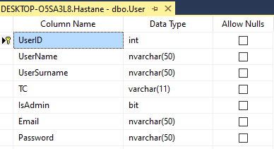

 

  <b>Şekil 1. Kayıtlı Hastaların Olduğu Tablo</b> 
  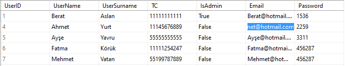

-	UserId, sütunu Primary Key özelliğinde olup otamatik artan (identity) bir integer değerdir. Her hastanın benzersiz(unique) kimliği olması gerekliliğinden UserId Primary Key olarak kullanılmıştır.
-	UserName, hastaların isim bilgilerini tutmasının yanı sıra giriş yaparken kullanılacak bir değişkendir. Hastalar farklı kültürlerden olabileceği ve isimlerini yazarken o kültürlere ait alfabeyi kullanabilecekleri için data tipi olarak nvarchar(50) kullanılmıştır. Nvarchar(50) kullanılmasındaki diğer bir sebep ise isim uzunluklarının değişken olmasından ötürü sabit bir veri tipinin veri tabanında boşa yer tutmasını engellemektir. Her hastanın bir ismi olması gerektiğinden boş bırakılmasına izin verilmemiştir.
-	UserSurname, hastaların soy isimlerinin tutulduğu değişkendir. UserNamede olan aynı sebeplerden dolayı Nvarchar(50) veri tipinde kullanılmıştır. Her hastanın bir soyadı olması gerektiğinden boş bırakılmasına izin verilmemiştir.
-	TC sütunu 11 karakter uzunluğunda ve sabit bir değişkendir boş bırakılmasına izin verilmemiştir.
-	IsAdmin, kayıtlı userların sistemde değişiklik yapıp yapamayacaklarını belirlemek için kullanılmıştır. Bit veri tipinde kullanılan bu değişkenin değeri 1 olduğu takdirde giriş sonrasında sistemde değişiklikler yapabilir.
-	Email, gerek duyulması halinde hastalarla iletişime geçebilmek için kayıt sırasında istenen email değeri nvarchar(50) veri tipinde olup boş bırakılmasına izin verilmemiştir.
-	Password, hastaların randevu oluşturmadan önce sisteme giriş yapmaları için gerekli bir değişkendir, boş bırakılmasına izin verilmez.

  <b>Tablo 2. Doctor</b> 
  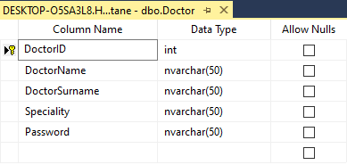

  <b>Şekil 2. Kayıtlı Doktorların Olduğu Tablo</b> 
  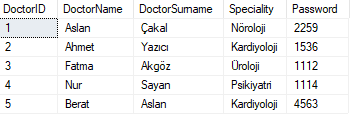

-	DoctorID sütunu, doktorların benzersiz bir kimliğe sahip olmaları için Primery Key yapılmıştır. Aynı zamanda değer girilmese bile düzenin bozulmaması için otomatik artan özelliği vardır. Değerleri sayıdan oluşacağı için data tipi integer olarak ayarlandı.
-	DoctorName, doktorların isimlerini saklamak için nvarchar(50) veri tipinde ayarlandı. Her doktorun mutlaka bir ismi olması gerektiğinden Allow Nulls özelliği devre dışı bırakıldı. Bu sütundaki değerler daha sonra randevu alma sırasında dropboxa çekilerek yeniden kullanılacaktır.
-	DoktorSurname, doktorların soyadlarının saklandığı sütun boş bırakılmasına izin verilmemiştir, nvarchar(50) veri tipinde.
-	Speciality(uzmanlık), hastanede çalışan doktorların hangi uzmanlıklarda hizmet ettiğine ilişkin bilginin tutulduğu nvarchar(50) veri tipindeki veridir.
-	Password , doktorların giriş yaparken kullandıkları şifre nvarchar(50) veri tipinde.

  <b>Tablo 3. Randevu</b> 
  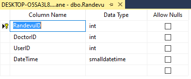

  <b>Şekil 3. Kayıtlı Randevuların Olduğu Tablo</b> 
  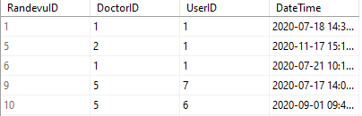

-	RandevuID, randevuların benzersiz kimlikliklerini tutmak için Primery Key olarak ayarlandı ve otomatik artan özelliği etkinleştirildi. Sakladığı değerler sayı olacağı için data tipi imteger olarak ayarlandı.
-	Randevu tablosundaki DoktorID, daha önce Doctor tablosunda Primery Key olarak tanımladığımız DoctorID ile ilişkilidir. Bu tabloda Foreign Key olarak tanımlanan DoctorID sayesinde randevular oluşturulurken hastanade kayıtlı olmayan bir doktora randevu oluşturulmasının önüne geçilmiştir. Randevu oluşturmak için doktorun mutlaka olması gerektiğinden Allow Nulls özelliği devre dışı bırakıldı. Sayısal bir değer tutulacağı için veri tipi integer olarak ayarlandı.
-	Randevu tablosundaki UserID, Foreign Key olup User tablosundaki UserID ile ilişkilidir. Bu ilişki sayesinde randevu oluşturulmadan önce hasta kaydı yapmamış bilgileri alınmamış bir hasta adına randevu oluşturulmasının önüne geçilmiş olur. Oluşturulacak randevular mutlaka bir hasta üzerine olacağından Allow Nulls özelliği devre dışı bırakıldı. Saklanan değer sayısal olduğundan veri tipi olarak integer ayarlandı.
-	DateTime sütunu, randevunun olacağı tarihi ve saati belirler. Allow Nulls özelliği devre dışı bırakılmış, randevular oluşturulurken salise cinsinden değerlere ihtiyaç duyulmadığından veri tipi olarak dd-mm-yyyy hh:mm.ss cinsinde tarih tutmaya yarayan smallDateTime kullanıldı.

  <b>Şekil 4. Tablolar Arasındaki İlişki ve Tablolardaki Değişkenler</b> 
  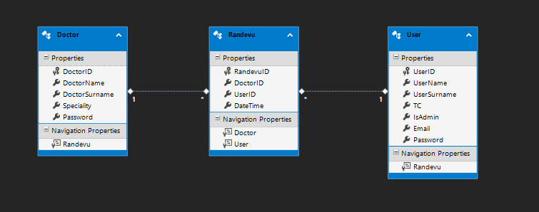

Yukarıdaki şekil Randevu oluşturmak için bir doktorun ve bir hastanın zorunlu olduğunu, bu tablolar arasında 1’e n ilişki bulunduğunu göstermektedir.

MVC’deki 3 katmandan biri olan controller sınıfı projede **HastaneController** olarak kullanıldı. HastaneController sınıfının içerisinde Index, Doktorlar, Uzmanlıklar, Randevular, İletişim, Login, Register, Logout ve Randevu gibi çoğu view oluşturmakta kullanılan ActionResultlar bulunmaktadır. Web sitelerinin çoğunda temel olarak Header, Sidebar, Content ve Footer dediğimiz bölümlerden Content kısmı HastaneController sınıfı içerisindeki viewlar sayesinde oluşturuldu. Header ve Footer kısımları masterpage yapısı kurularak her sayfada bu bölümlerin sabit kalması sağlandı. Sidebar kısmı ise bu projede kullanılmadı. Şimdi masterpage ve view sayfalarını daha detaylı bir şekilde ele alalım.

  <b>Şekil 5. Header</b> 
  

  <b>Şekil 6. Footer</b> 
  

MVC projelerinde Shared Veiwlar yani tüm sayfaların paylaştığı ortak viewlar bulunmakta. **LayoutPage** olarak tanımlanan bu viewlar sayesinde tüm sayfalarda tekrar tekrar kullanılacak tablo, menü, button vb. nesnelerin her seferinde kodlanmasıyla oluşacak kod fazlalığını ve karmaşayı önlenmekte.

Projede her sayfanın başında **Header**, sonunda ise **Footer** bulunduğu için bu yapılar LayoutPage içerisinde kodlandı. Daha sonra diğer viewlar LayoutPage’i tek satırlık bir kod sayesinde kendi sayfa yapısıymış gibi kullanabildi.

-	Şekil 5’de görülen Header yapısı Bootsrap içerisinde bulunan fixed-top komutu ile her daim sayfanın yukarısında görünecek şekilde yukarıya sabitlendi.
-	Header içerisinde HastaneController sınıfında tanımlanan diğer viewlara ulaşmayı sağlayan menü elemanları ve giriş çıkış için kullanılan modalların butonları bulunmakta.
-	Menu elemanlarının yanındaki küçük ikonlar font awesome kütüphanesi kullanılarak elde edildi.
-	Sayfa yoğunluğunu azaltmak, kullanım kolaylığı sağlamak için giriş ve kayıt butonları Header üstünde her sayfadan ulaşılabilecek üzere tanımlandı.
-	Şekil 6’daki Footer her sayfanın altında görünecek şekilde ayarlandı.
-	Sayfanın altına inildiğinde diğer sayfalara ulaşımı kolaylaştırmak için o sayfaların bağlantıları footera kaydedildi.

  <b>Şekil 7. Giriş Modalı</b> 
  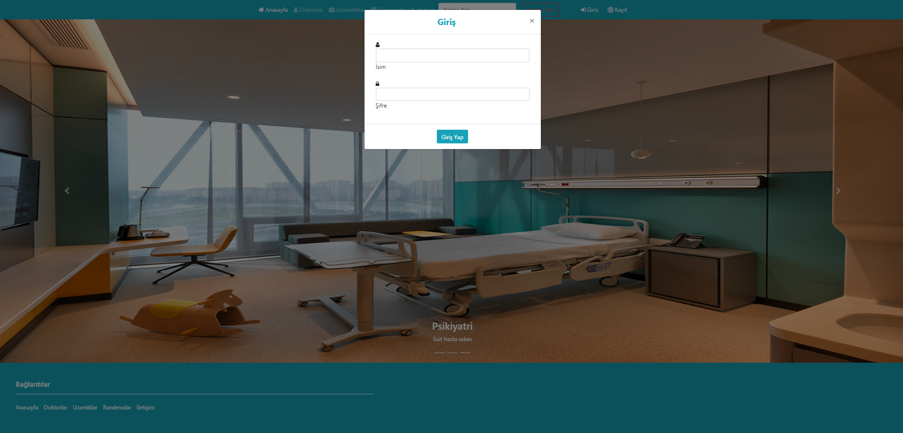

  <b>Şekil 8. Giriş Modalı Yakından</b> 
  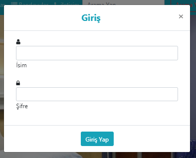

Header üzerinde bulunan giriş butonu kullanım kolaylığı sağlaması açısından ve sayfa fazlalığı oluşturmama açısından Modal olarak tanımlandı, yani giriş butonuna basıldığında yeni bir sayfaya yönlendirilmek yerine bulunduğunuz sayfadan Pop-up olarak açılan giriş sayfasından giriş yapılabilir. Giriş Modalında kullanıcılardan kayıt olurken kullandıkları isim ve yine kayıt sırasında belirledikleri şifreleri istenmekte. Girilen bilgiler user tablosundaki veriler ile karşılaştırıldığında doğruluk sağlanıyor ise hastanın giriş bilgileri sessionda tutularak giriş başarıyla gerçekleşir. Giriş yapıldıktan sonra modal gereği giriş butonuna tıklanılan sayfadan web uygulaması üzerindeki gezintiye devam edilir. Form yapısı içerisinde bulunan textler post metoduyla HastaneController sınıfı içerisindeki Login ActionResultuna, user tablosundan oluşturulmuş bir model olarak gönderilir.

  <b>Şekil 9. Giriş Sonrası Header</b> 
  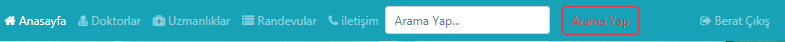

Giriş başarıyla gerçekleştiğinde Headerda gözüken giriş ve kayıt butonları artık gereksiz olacağından bu butonlar yerine artık şekil 9’de görüldüğü üzere giriş yapan kullanıcının adı ile birlikte çıkış butonu gözükmektedir. Giriş yapan kullanıcın bilgileri sessionda tutularak randevu oluştururken tekrar kullanılacaktır. Şekil 8’deki çıkış butonuna basıldığında session bilgileri silinerek header şekil 5’deki eski haline gelmektedir.

  <b>Şekil 10. Kayıt Modalı</b> 
  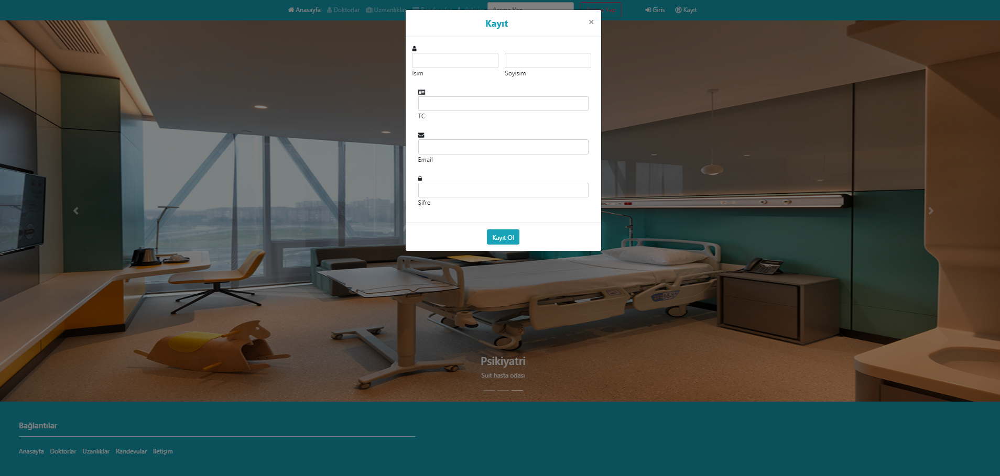

  <b>Şekil 11. Kayıt Modalı Yakından</b> 
  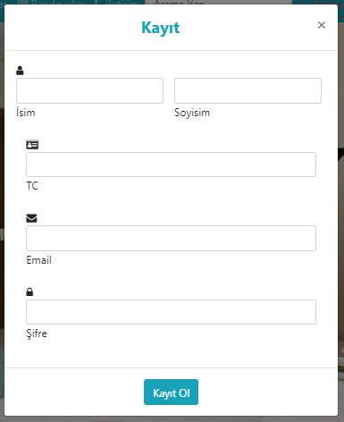

LayoutPage sayfasında tanımlı olan header üzerinden ulaşılabilen kayıt butonu, giriş butonunda da olduğu gibi tüm sayfalarda(viewlarda) bulunmaktadır. Yine giriş butonu gibi kullanım kolaylığı sağlaması açısından ve sayfa yapısındaki karışıklığı önlemek, sayfa sayısını en azda tutmak için Modal(Pop-up) cinsinden yapılmıştır. Kayıt Modalı içerisinde, veri babanı kısmında da bahsi geçen isim, soyisim, TC, E-mail ve şifre gibi veriler istenmiş. Bu verilerin modal üzerinden alınmasında **HtmlHelper** nesnesinden üretilen **TextBoxFor** metodu kullanılmıştır. Bu metot sayesinde C# kodu yazarmışçasına @html kullanılarak istenilen tarzda veriler çekilebilir, uzun satırlarca sürecek html kodlarını yazmaktan kurtarılabilir. Kullanıcıların şifreleri istenirken ise TextBoxFor yerine şifrenin yazarken gözükmemesi, güvenliğin sağlanması adına **PasswordFor** metodu çağrılır. Kullanılan bu metotlar HastaneController sınıfı içerisinde bulunan Register sayfasına(viewına) **HttpPost** yöntemiyle gönderilir. HttpPost sayesinde veriler adres çubuğunda görülmeden iletilmesi gerekilen yere iletilir.

  <b>Şekil 12. Ana Sayfa</b> 
  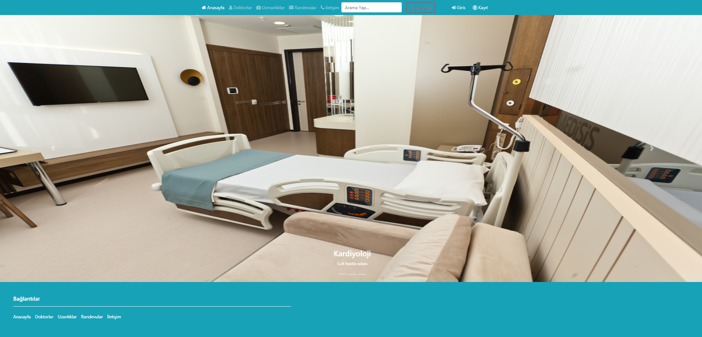

Ana sayfada hastanenin sahip olduğu odalar tanıtılmış ve bu odalar hakkında slide üzerinden kısa bilgiler verilmiştir. Slide yapımında bootsrap içerisinde bulunan Carousel slide sınıfından yararlanıldı. Slide zaman içerisinde kendi kendine akabileceği gibi istenmesi durumunda sağ ve solda bulunan butonlar sayesinde resimler arasında geçiş yapılabilir duruma getirildi. Alt tarafta ise kaç resim bulunduğu ve hangi resme bakıldığının anlaşılması için küçük kutucuklar kullanıldı. Resimlerin genişliği ekran boyutunu tamamen kaplayacak şekilde ayarlandı, yükseklikleri ise footerın ekranında altında kalması için height özelliği kullanılarak elle ayarlandı. Web uygulaması hastane hizmeti içerdiği için tema rengi olarak headerlarda, footerlarda ve butonlarda renk olarak bootstrap içerisinde bulunan info rengi kullanıldı.

-	Index sayfası olarak da adlandırılan ana sayfa projenin başlatıldığında kullanıcının karşısına çıkan ilk sayfadır.
-	Her sayfada olduğu gibi bu sayfada da header ve footerlar bulunmaktadır. Layout sayfası olarak layoutPage sayfası atandı.
-	Sayfanın content(içerik) kısmında caousel slide kullanıldı.
 

  <b>Şekil 13. Doktorlar</b> 
  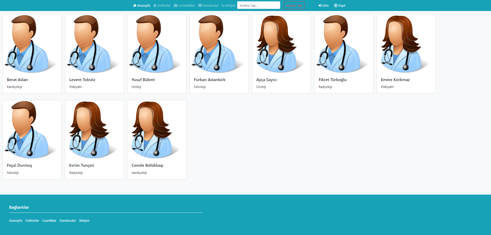

Bu sayfada hastanede çalışan doktorların adları, soyadları, uzmanlıkları ve resimleri bulunmaktadır. Randevu oluşturulmadan önce hatta giriş yapılmadan önce de doktorlar hakkında kısa bilgilere ulaşılabilir. Sayfayı oluşturmak için card sınıfından yararlanıldı, resimler ise pngFlow sayfasından uygun boyutlarda ve arkası şeffaf bir şekilde projeye uygun hale getirilerek indirildi. LayoutPage viewı sayfaya eklenerek header ve footerın oluşması sağlandı.

  <b>Şekil 14. Uzmanlıklar</b> 
  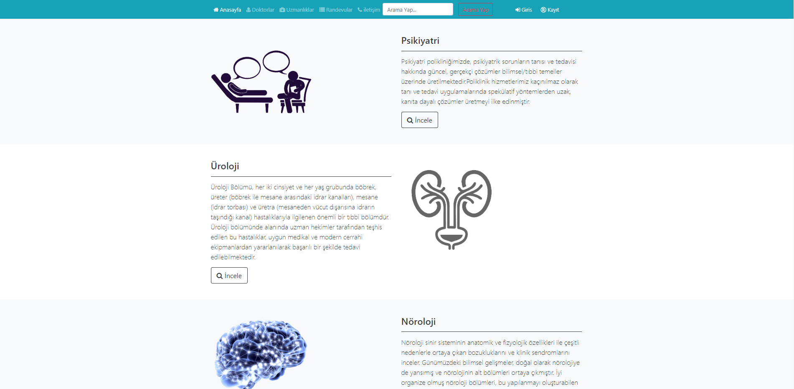

Web uygulamasında bulunan bu sayfada hastanenin hizmet verdiği uzmanlıklar bulunur. Aynı satır düzeni içerisinde bulunan, pngFlow sayfasından elde edilen görsel ile o uzmanlığa ait genel bilgiler yan yana verilmiştir. Layout özelliğini LayoutPage adlı düzenden alan bu sayfa header ve footerı bulundurmaktadır. Şekil 14’de footerın görünmemesinin sebebi sayfanın aşağıya doğru devam etmesinden kaynaklıdır. Sayfa üzerindeki okumayı kolaylaştırmak ve sayfa düzeninde güzel bir görüntü elde etmek için her uzmanlık için ayrılan satırlar farklı arka plan rengi ile ifade dilmiştir.

  <b>Şekil 15. İletişim</b> 
  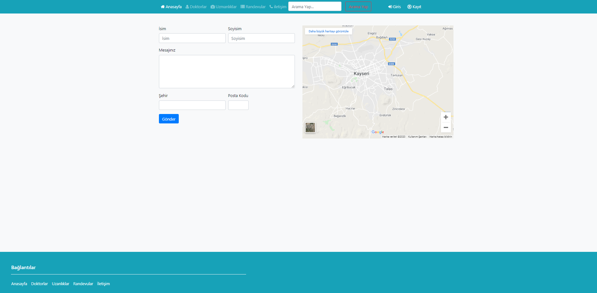

15. şekilde gösterilen iletişim sayfası, hastaların memnuniyetsizliklerini, şikayetlerini, sorularını vb. düşüncelerini hastane ile iletişime geçerek paylaşmak istemeleri durumunda mesaj gönderebilmeleri için tasarlanmıştır. Kullanıcıların mesaj göndermeden önce isim, soy isim, şehir ve posta kodu gibi bilgileri girmeleri gerekmektedir. Yine iletişim sayfası içerisinde bulunan Google haritalar kullanılarak hastanenin yeri rahatlıklar tüm kullanıcılar tarafından bulunabilir. Şekil 15’deki haritada gerçek bir hastanenin yeri işaretlenebilir. LayoutPage sayfası bu sayfaya da eklenmiştir.  

  <b>Şekil 16. Randevular</b> 
  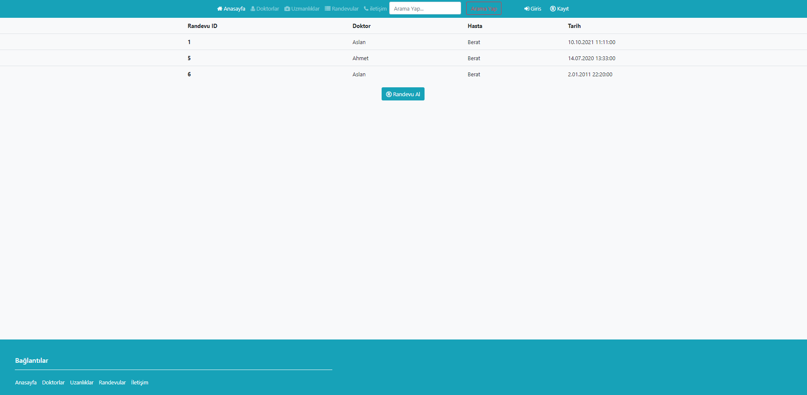

Şekil 16’da randevular sayfası bulunmaktadır. Sayfadaki tablo center-block metoduyla ortaya sabitlendi. Tablo içerisinde sütunlar Randevu ID, Doktor, Hasta ve Tarih bilgilerini içermektedir. Bu bilgiler veri tabanının randevular adlı tablodan çekildi ancak veri tabanındaki bu tabloda doktorların ve hastaların adları değil ID’leri bulunmaktaydı. Bu sorunu düzeltmek için randevular HastaneController sınıfında listeye dönüştürülerek viewBag.randevularlistesi şeklinde kaydedildi. Daha sonra bu ViewBag içerisinde bulunan tüm elemanlar foreach döngüsüne sokularak tabloya eleman olarak kaydedildi. Tablonun altında orta kısımda bulunan buton ise giriş yapıldıktan sonra hastaların randevu almalarını sağlayan modal randevu al butonudur.

  <b>Şekil 17. Randevu Alma</b> 
  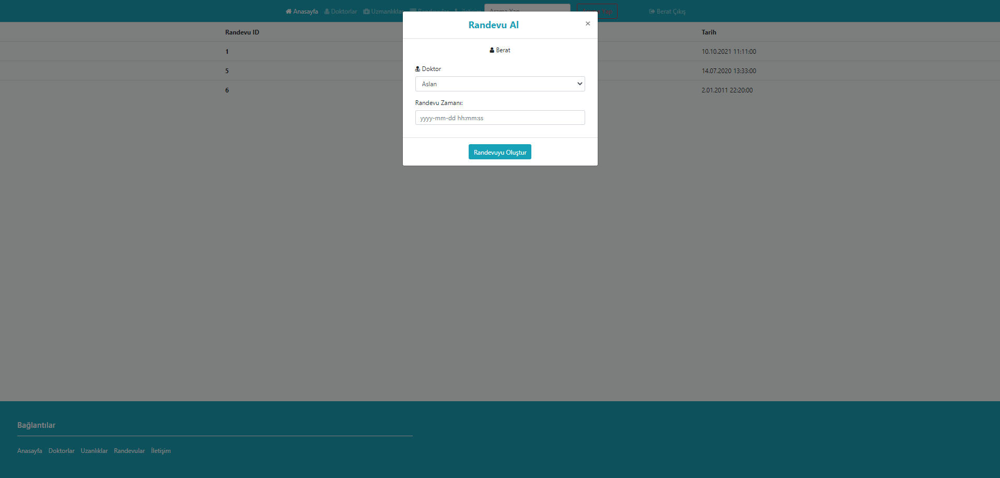

  <b>Şekil 18. Randevu Alma Modalı Yakından</b> 
  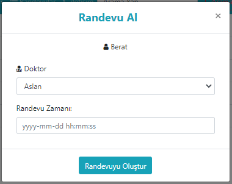

Modal sınıfından yararlanılarak yapılan randevu al butonu projeye uyumluluğu açısından yazılar ve buton arka planı projede kullanılan renk ile aynı yapıldı. Hasta giriş yaptıktan sonra session üzerinde tutulan hasta adı bu modal üzerinde görünmektedir. Doktorların bulunduğu satırda ise dropdownlist bulunmaktadır. DropDownList içerisindeki bilgiler doktorlar veri tabanından oluşturulup liste haline getirilen ViewBag.dr üzerinden çekilmiştir. Randevu zamanının girileceği textde ise placeholder kullanılarak text içerisine yazılması gereken tarih ve saat formatı gösterilmiştir. Doktorun seçildiği listede html helper sınıfından DropDownListFor sayesinde veriler HastaneContrroller içerisindeki randevu ActionResult’una post edilmiştir. Aynı şekilde randevu zamanının bulunduğu text de html helper sınıfından TextBoxFor metodu ile aynı ActionResult’a post edildi. Randevu ActionResult’u, randevu cinsinden bir nesne oluşturup post edilen bu bilgileri nesneye eklendi. Hasta adı ise post edilmeye gerek kalmadan session üzerinden nesneye eklendi. Nesneye tüm elemanlar eklendikten sonra veri tabanına eklenip veri tabanındaki değişiklikler kaydedildi.
